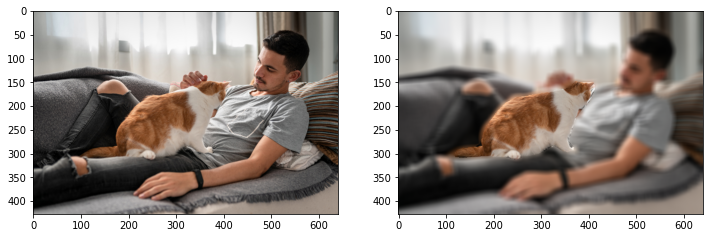
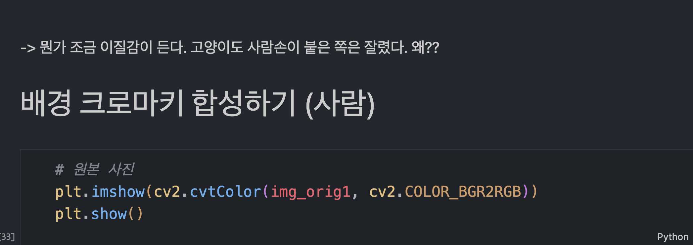
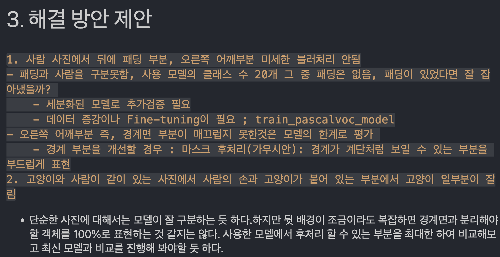

# AIFFEL Campus Online Code Peer Review Templete
- 코더 : 코더의 이름을 작성하세요.
- 리뷰어 : 리뷰어의 이름을 작성하세요.


# PRT(Peer Review Template)
- [X]  **1. 주어진 문제를 해결하는 완성된 코드가 제출되었나요?**

    

    

주어진 문제를 해결한 완성된 코드가 제출되었습니다.

</br>
</br>
    
- [X]  **2. 전체 코드에서 가장 핵심적이거나 가장 복잡하고 이해하기 어려운 부분에 작성된 
주석 또는 doc string을 보고 해당 코드가 잘 이해되었나요?**


</br>

셸 사이사이 Markdown을 통해 어떤 코드를 수행하는 지 잘 작성하셔서 이해하기 쉬웠습니다.

</br>
</br>

- [X]  **3. 에러가 난 부분을 디버깅하여 문제를 해결한 기록을 남겼거나
새로운 시도 또는 추가 실험을 수행해봤나요?**



마지막 Markdown을 통해 문제를 해결하는 새로운 방법을 제안하였습니다.

</br>
</br>

- [X]  **4. 회고를 잘 작성했나요?**


셸 사이사이 Markdown을 통해 회고를 잘 작성하셨습니다.

</br>
</br>


- [X]  **5. 코드가 간결하고 효율적인가요?**


함수화를 통해 간결한 코드를 작성하였습니다.

# 회고(참고 링크 및 코드 개선)
```
함수화와 Markdown 셸을 통해 코드를 잘 깔끔하게 잘 구현하신 것 같습니다.
```
